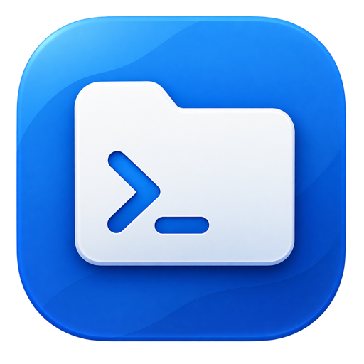
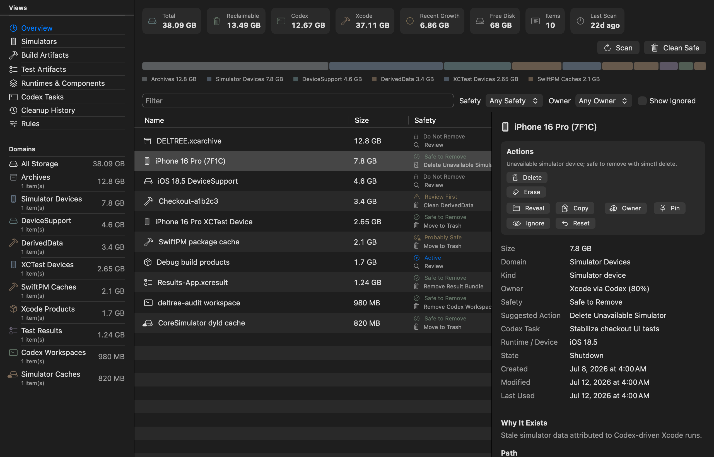
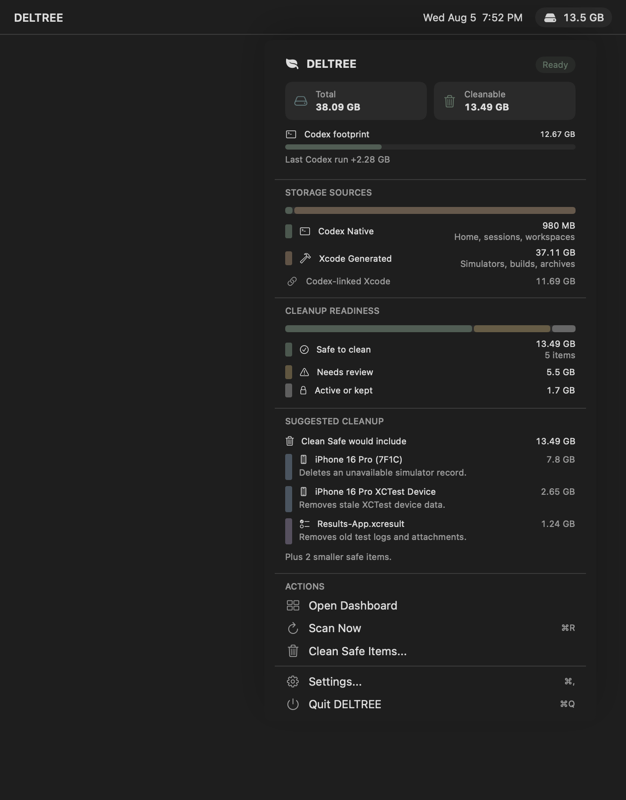
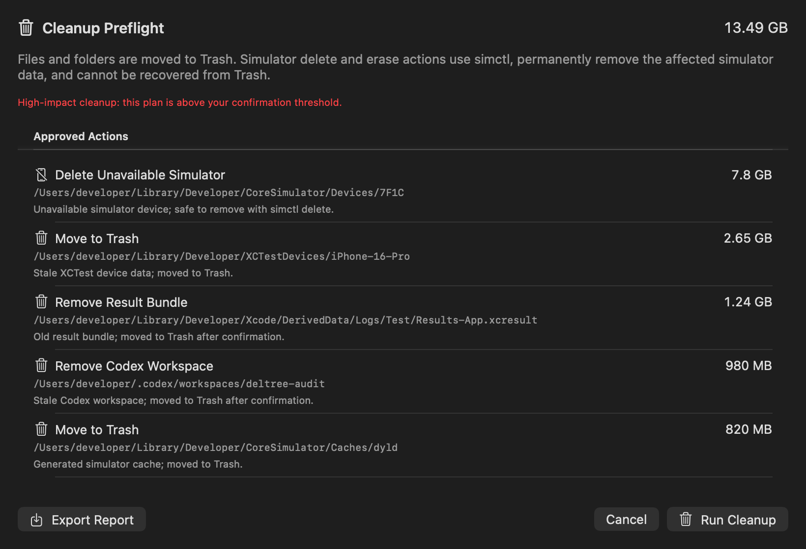
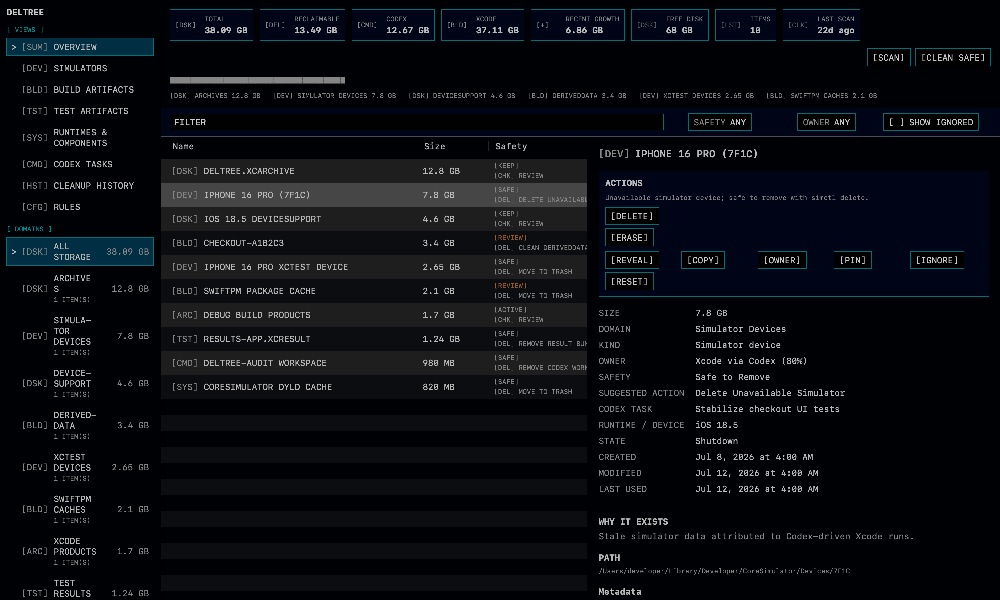
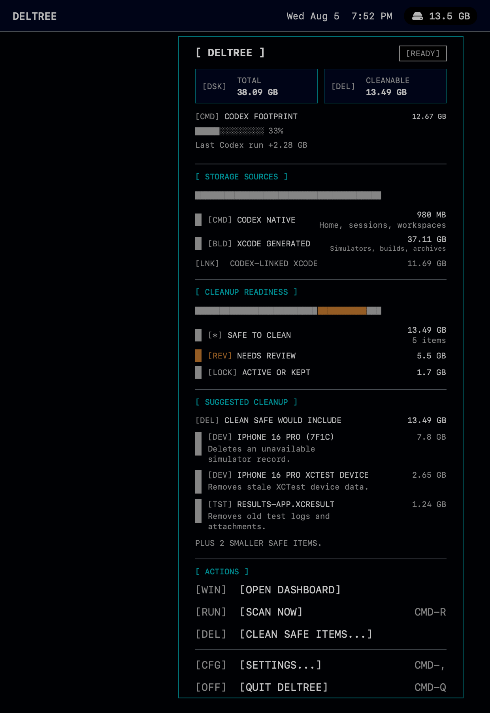

# DELTREE

[](https://github.com/hazennik/DELTREE/actions/workflows/ci.yml)
[](https://www.apple.com/macos/)
[](https://swift.org)
[](LICENSE)
[](https://github.com/hazennik/DELTREE/releases)

DELTREE is a local-only macOS menu-bar utility for understanding and safely managing the disk space created by Codex-driven iOS and macOS development.

It scans bounded Codex and Xcode storage locations, explains what it found, labels cleanup risk, and only performs cleanup after explicit confirmation.

```text
C:\> DELTREE
SCAN CODEX + XCODE STORAGE
TRASH ONLY. LOCAL ONLY. NO TELEMETRY.
```



> Status: release-candidate preparation. Local checks pass, but public GA still requires green hosted CI, a current signed/notarized release candidate, Sparkle update testing, and clean-machine QA.

## Install

Signed app downloads are not published yet. Until the first notarized release is published, build from source:

```sh
git clone https://github.com/hazennik/DELTREE.git
cd DELTREE
make build
open build/DerivedData/Build/Products/Debug/DELTREE.app
```

When the first signed app release is ready, downloads will be published through [GitHub Releases](https://github.com/hazennik/DELTREE/releases):

```sh
curl -L -o DELTREE.zip https://github.com/hazennik/DELTREE/releases/latest/download/DELTREE.zip
ditto -x -k DELTREE.zip .
open DELTREE.app
```

Homebrew Cask support is staged for the notarized release channel:

```sh
brew install --cask hazennik/deltree/deltree
```

## Build

Requirements:

- macOS 14 or newer.
- Xcode 17 or newer for the Swift 6 strict-concurrency project settings.
- Swift 6-era toolchain from Xcode.

Common commands:

```sh
make build
make test
make swift-test
make analyze
make cli-dry-run
```

`make test` runs the unit test bundle. `make ui-test` performs a deterministic signed menu-bar launch smoke test. The legacy Xcode UI automation runner remains available as `make xcode-ui-test` for local investigation.

Formatting and linting use SwiftFormat and SwiftLint:

```sh
brew install swiftformat swiftlint
make lint
make format
```

The SwiftPM package exposes the app's core models and services as `DELTREECore`, so contributors can run focused tests without opening Xcode:

```sh
swift test
```

Release dry-runs validate the packaging, notarization, and appcast command paths without signing credentials:

```sh
make package-check
make appcast-check
make spark-sign-check
```

## Privacy

DELTREE is local-only. It reads known developer paths, local Codex metadata when present, and local process state for attribution. It does not upload scan results, cleanup history, paths, account data, or project metadata.

Read the full policy in [PRIVACY.md](PRIVACY.md).

## Safety

DELTREE is intentionally conservative.

- No full-disk crawl by default.
- No silent cleanup.
- Regular files and folders are moved to Trash; explicit simulator delete/erase actions permanently remove simulator data.
- Booted or active simulators are never cleaned.
- Archives, dSYMs, runtimes, DeviceSupport, and simulator images are excluded from one-click cleanup.
- Every cleanup plan is revalidated before execution.

Read the full policy in [docs/SAFETY.md](docs/SAFETY.md).

## Screenshots

Modern is the primary public screenshot set because it best matches repeated day-to-day macOS use.







Classic keeps the retro command-prompt identity available as a smaller secondary set.

<p>
  
  
</p>

## What It Does

- Shows Codex/Xcode storage impact from a quiet menu-bar icon.
- Uses DELTREE Classic by default: terminal-style panels, monospaced scan output, block storage meters, and explicit `[SAFE]` / `[REVIEW]` / `[KEEP]` labels.
- Keeps the previous macOS-native visual system available as `Modern` from Settings.
- Scans CoreSimulator devices, XCTest devices, DerivedData, result bundles, archives, DeviceSupport, simulator runtimes/images, SwiftPM caches, `~/.codex`, and Codex workspaces.
- Enriches simulator rows with `simctl` metadata.
- Correlates filesystem changes with Codex, Xcode, `xcodebuild`, `simctl`, Simulator, and CoreSimulatorService activity.
- Labels items as `Safe to Remove`, `Probably Safe`, `Review First`, `Do Not Remove`, or `Unknown`.
- Moves approved files to Trash instead of hard-deleting them.
- Uses explicit `simctl delete` and `simctl erase` commands for simulator-specific actions and identifies them as irreversible in cleanup preflight.
- Persists scan history, recent growth, manual overrides, and cleanup records with SwiftData.

## Menu Bar States

The menu-bar item is icon-only:

- Outline or pixel icon: idle.
- Filled icon: scanning.
- Green/cyan dot: reclaimable storage found.
- Orange/amber dot: warning, low disk, or unreadable paths.

Totals and explanations live in the dropdown and dashboard so the menu bar stays quiet.

## CLI Helper

The bundled helper performs a bounded dry-run inventory and never deletes files:

```sh
Tools/deltree --dry-run
Tools/deltree --dry-run --json
```

Human output uses the Classic terminal dashboard style. JSON output remains stable for scripts.

Install it locally:

```sh
Scripts/install-cli.sh
```

## Distribution

DELTREE is intended for Developer ID distribution outside the Mac App Store because it needs to inspect developer folders and move approved items to Trash.

Packaging notes live in [Packaging/README.md](Packaging/README.md), release steps live in [docs/RELEASING.md](docs/RELEASING.md), and local signing setup lives in [docs/LOCAL_RELEASE.md](docs/LOCAL_RELEASE.md). Public distribution uses local Developer ID signing, Apple notarization, Sparkle appcast signing, and GitHub Release asset hosting.

## Documentation

- [Vision](VISION.md)
- [Roadmap](ROADMAP.md)
- [User Guide](docs/USER_GUIDE.md)
- [Architecture](docs/ARCHITECTURE.md)
- [Development](docs/DEVELOPMENT.md)
- [Production Readiness](docs/PRODUCTION_READINESS.md)
- [Public Release Checklist](docs/PUBLIC_RELEASE_CHECKLIST.md)
- [Permissions & Troubleshooting](docs/PERMISSIONS.md)
- [Safety Policy](docs/SAFETY.md)
- [CLI](docs/CLI.md)
- [Release Process](docs/RELEASING.md)
- [Release QA](docs/RELEASE_QA.md)
- [Homebrew Cask Plan](docs/HOMEBREW.md)
- [Support Workflow](docs/SUPPORT_WORKFLOW.md)
- [Issue Triage](docs/TRIAGE.md)
- [Icon Pipeline](docs/ICON.md)
- [Privacy](PRIVACY.md)
- [Code of Conduct](CODE_OF_CONDUCT.md)
- [Third-Party Notices](THIRD_PARTY_NOTICES.md)

## License

MIT. See [LICENSE](LICENSE).
