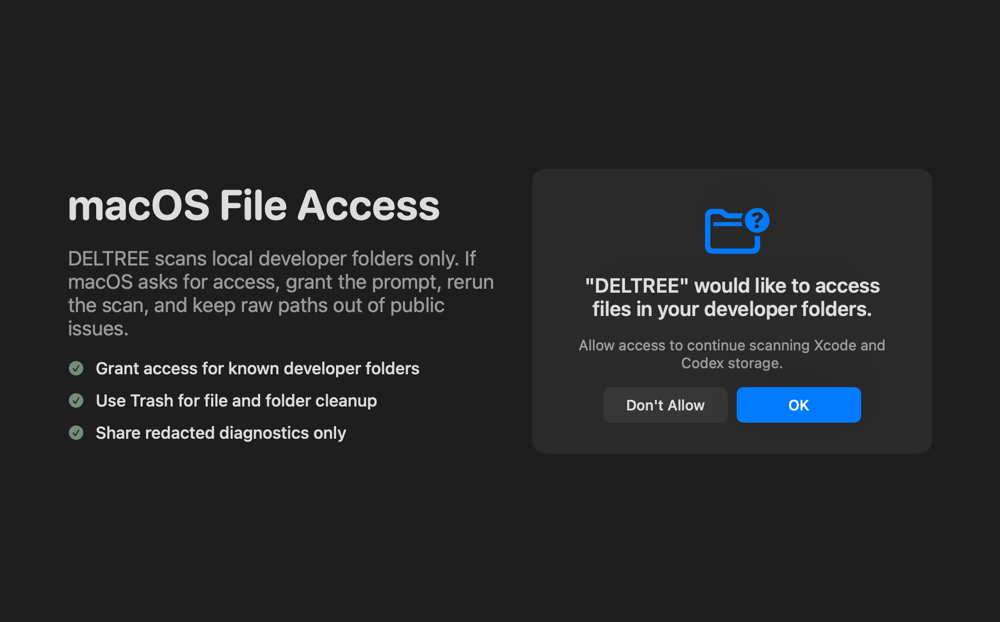

# Permissions & Troubleshooting

DELTREE scans local developer storage and prepares cleanup plans on-device. It does not require cloud credentials, upload scan inventories, or permanently remove regular files outside explicit cleanup execution.



## macOS Permissions

macOS may ask for file access when DELTREE scans folders outside its default sandbox reach, such as custom Codex workspaces, Xcode archives, or external volumes. Grant access only for locations you want DELTREE to inspect.

Full Disk Access is not required for the standard scan paths. If a custom location remains unreadable after a normal file-access prompt, you can either remove that location from DELTREE's scan roots or grant broader access in System Settings.

Notifications are optional. They are used for scan and cleanup completion notices, not for background tracking.

## Cleanup Behavior


DELTREE separates scanning from cleanup. A scan inventories candidate storage; cleanup requires a reviewed plan and explicit confirmation.

Regular files and folders are moved through macOS Trash when possible. Simulator device cleanup uses Apple's simulator tooling rather than directly removing device directories. Simulator delete and erase actions permanently remove the affected simulator data, are identified in preflight, and cannot be recovered from Trash. DELTREE records skipped items when it cannot safely classify or access a candidate.

## Common Issues

### Scan Shows Unreadable Paths

Check that the folder still exists and that DELTREE has permission to read it. For custom scan roots, remove stale paths or add the current folder again from the app.

### Cleanup Skips an Item

Skipped cleanup usually means the item changed after the scan, is still active, or no longer matches the safety policy. Run a fresh scan before retrying.

### Trash Move Fails

Confirm the volume supports Trash and that Finder can move an item from the same folder to Trash. Network shares and external volumes can behave differently from the local startup disk.

### Legacy UI Automation Hangs

`make ui-test` is the release-gating signed launch smoke test. If you are debugging Xcode UI automation specifically, use `make xcode-ui-test`; it has a timeout wrapper because Xcode can hang while waiting for UI test workers.

## Diagnostics

For public issues, include redacted diagnostics only:

```sh
Tools/deltree diagnose --json
```

Do not paste `--raw-paths` output into public issues. Raw diagnostics can include private project names, usernames, and local directory structure.
